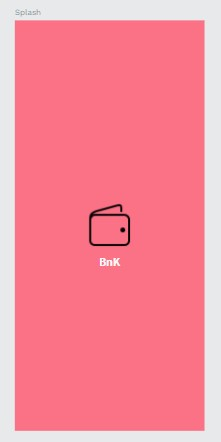
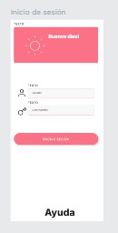
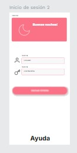

# Proyecto: Aplicación de Gestión de Servicios Financieros

## Descripción
Este proyecto es una aplicación móvil para gestionar diversas operaciones financieras, tales como transferencias, pagos de servicios y extracciones sin tarjeta. La aplicación tiene un enfoque en la simplicidad y la eficiencia, facilitando al usuario realizar operaciones de forma rápida y segura. El diseño de la aplicación sigue un esquema de colores unificado y está optimizado para ofrecer una experiencia de usuario coherente.

## Lenguaje de Diseño

- **Colores**:
  - Color primario: `#fb7185`  
  - Color complementario: `#1fb7185` 

- **Tipografía**: 
  - Familia: Inter.
  - Variantes: Se utilizan diferentes pesos y tamaños para mejorar la legibilidad.

### Componentes
- **Botones**: Variantes redondas y rectangulares para diferentes acciones.
- **Formulario de texto**: Campos con diferentes estados (vacíos, completados).
- **Iconos**: Utilizados para representar acciones clave como transferir, pagar y extraer.

### Pantallas
- **Splash Screen**: Pantalla inicial con el logo de la app.

*Figura 1: Splash screen*
- **Onboarding**: Introducción rápida para nuevos usuarios.
- **Inicio de Sesión**: El usuario puede iniciar sesión con su nombre de usuario y contraseña, con un ajuste visual para unificar los colores de los iconos a blanco. El diseño del inicio de sesión varía según la hora del día, mostrando una variante nocturna con un ícono de luna y colores más tenues para la noche, y una variante diurna con un ícono de sol y colores más brillantes. Esto mejora la experiencia del usuario y adapta la interfaz a diferentes condiciones de luz.

*Figura 2: Pantalla de inicio de sesión con modo diurno.*

*Figura 3: Pantalla de inicio de sesión con modo nocturno.*
  
## Flows

### Transferencia
- **Flow Completo**:
  - La interfaz de transferencia permite al usuario seleccionar una cuenta de origen y destino, ingresar el monto, confirmar con clave, y visualizar un mensaje de éxito.
  - El botón de transferencia está deshabilitado hasta que todos los campos requeridos estén completados.

- **Interfaz compartida**: Las pantallas de clave y de espera se utilizan a lo largo del flow para mantener consistencia.

### Pago de Servicios
- **Flow Completo**:
  - Similar al flow de transferencias, pero con la opción adicional de programar un pago para una fecha futura.

### Pantalla Principal
- **Funciones**:
  - Muestra el saldo en cuenta, opciones de transferir, pagar o extraer.
  - Historial de movimientos recientes.

## Trabajo Futuro
- Implementación de la funcionalidad de agendar pagos.
- Interfaz de extracción sin tarjeta con código.
- Gestión de tarjetas de débito/crédito y su respectivo flow.

## Notas de Desarrollo
- **Comunicación**: Los flujos de la aplicación fueron iterados rápidamente con revisiones frecuentes entre el equipo, con sugerencias, comentarios y correcciones que ayudaron a mejorar la interfaz final.
